# Results of the JMeter Tests via GUI

## 1️⃣ Endpoint: `/all-student`
- **View Results Tree** : 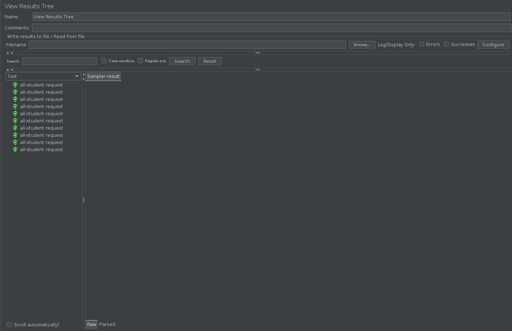
- **View Results in Table** : 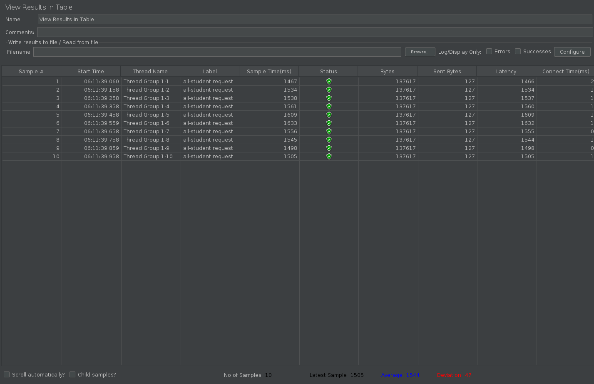
- **Summary Report** : 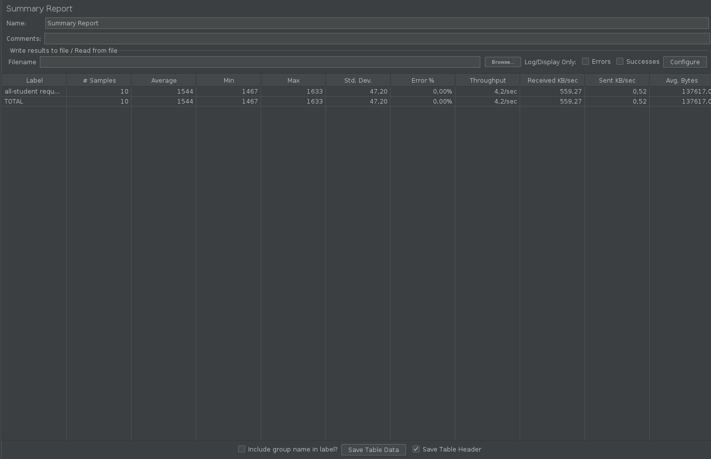
- **Graph Results** : 

---

## 2️⃣ Endpoint: `/all-student-name`
- **View Results Tree** : 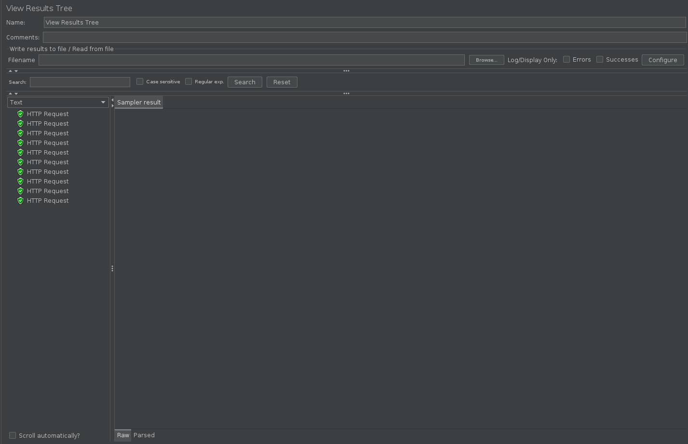
- **View Results in Table** : 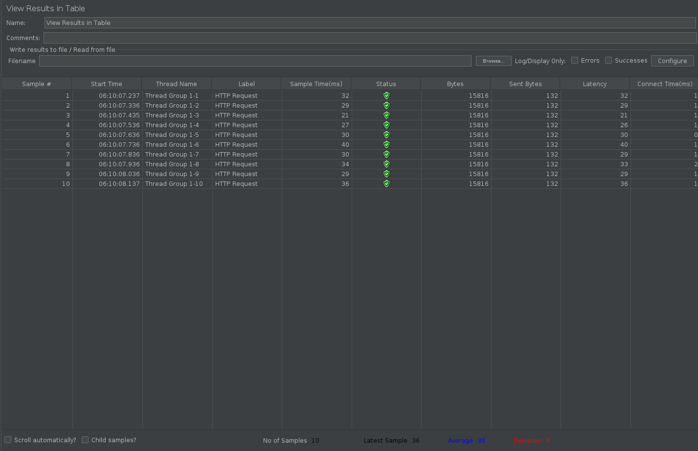
- **Summary Report** : 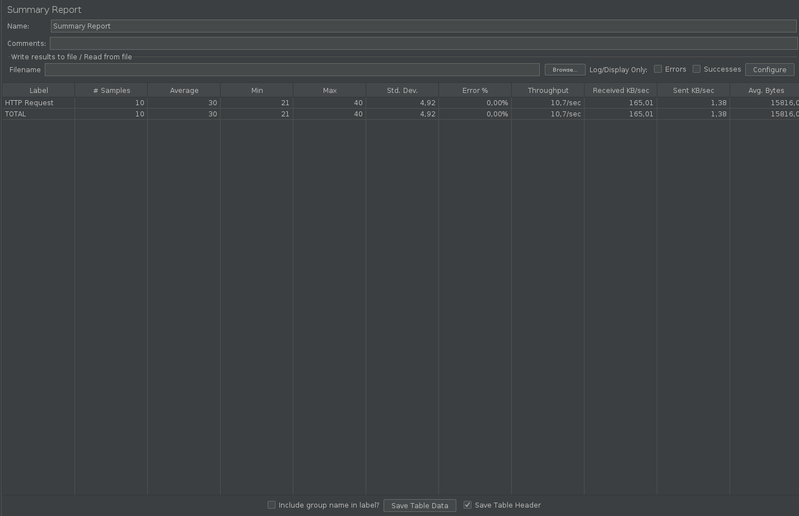
- **Graph Results** : 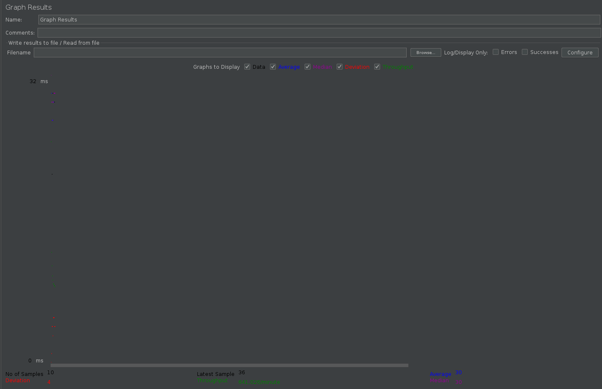

---

## 3️⃣ Endpoint: `/highest-gpa`
- **View Results Tree** : 
- **View Results in Table** : 
- **Summary Report** : 
- **Graph Results** : 

# Results of the JMeter Tests via command line

## 1️⃣ Endpoint: `/all-student`
- **test_result_log1.jtL** : 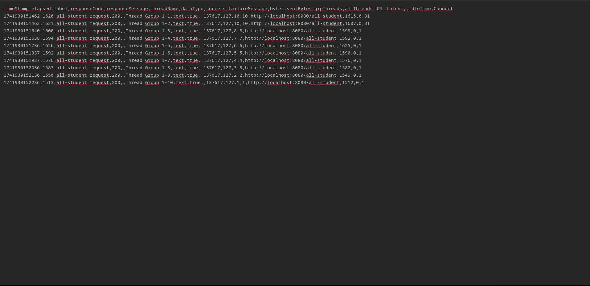

---

## 2️⃣ Endpoint: `/all-student-name`
- **test_result_log2.jtL** : 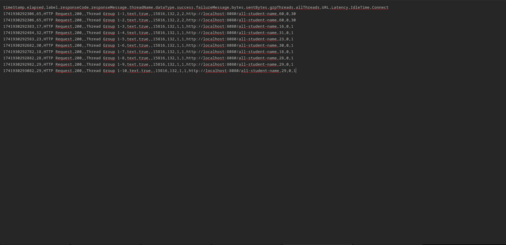

---

## 3️⃣ Endpoint: `/highest-gpa`
- **test_result_log3.jtL** : 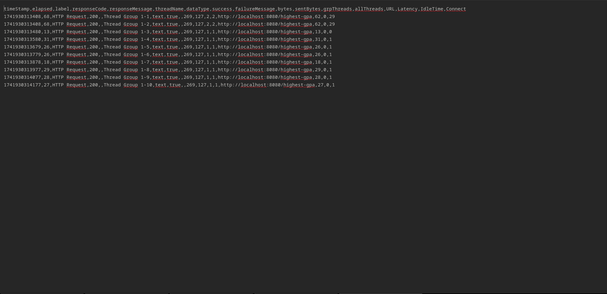

### Analyse of the JMeter Tests results after optimization

## 1️⃣ Endpoint: `/all-student`
- **Before Optimization** : 
- **After Optimization** : 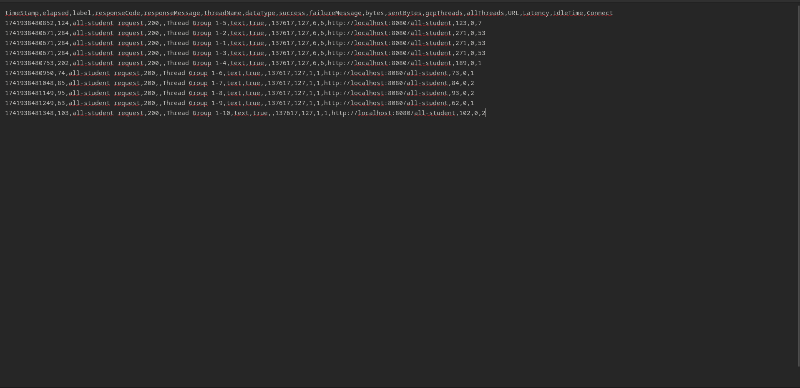

---

## 2️⃣ Endpoint: `/all-student-name`
- **Before Optimization** : 
- **After Optimization** : 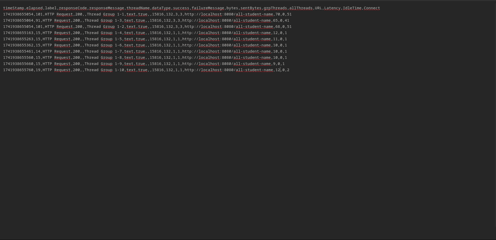

---

## 3️⃣ Endpoint: `/highest-gpa`
- **Before Optimization** : 
- **After Optimization** : 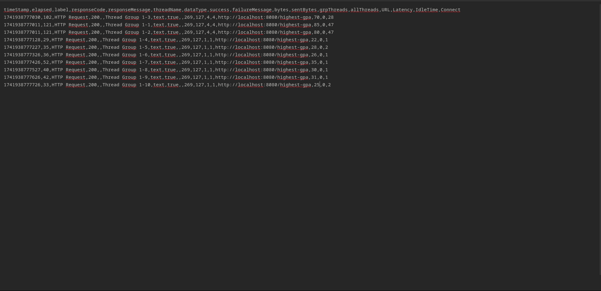

After optimizing the joinStudentNames() and findStudentWithHighestGpa() methods by reducing the use of findAll() and replacing it with more efficient queries, we conducted a new performance test using JMeter.

- Response Time: We observed a significant reduction in execution time for both methods, indicating faster data retrieval.
- Throughput: The number of requests handled per second increased, demonstrating improved efficiency.
- Database Load: The optimized queries reduced the amount of data fetched, lowering the overall database workload.

The optimizations have successfully improved the application's performance by reducing unnecessary data retrieval. Instead of loading all student records and processing them in memory, we now fetch only the necessary data directly from the database, making the application more efficient and scalable
