# Results of the JMeter Tests via GUI

## 1️⃣ Endpoint: `/all-student`
- **View Results Tree** : 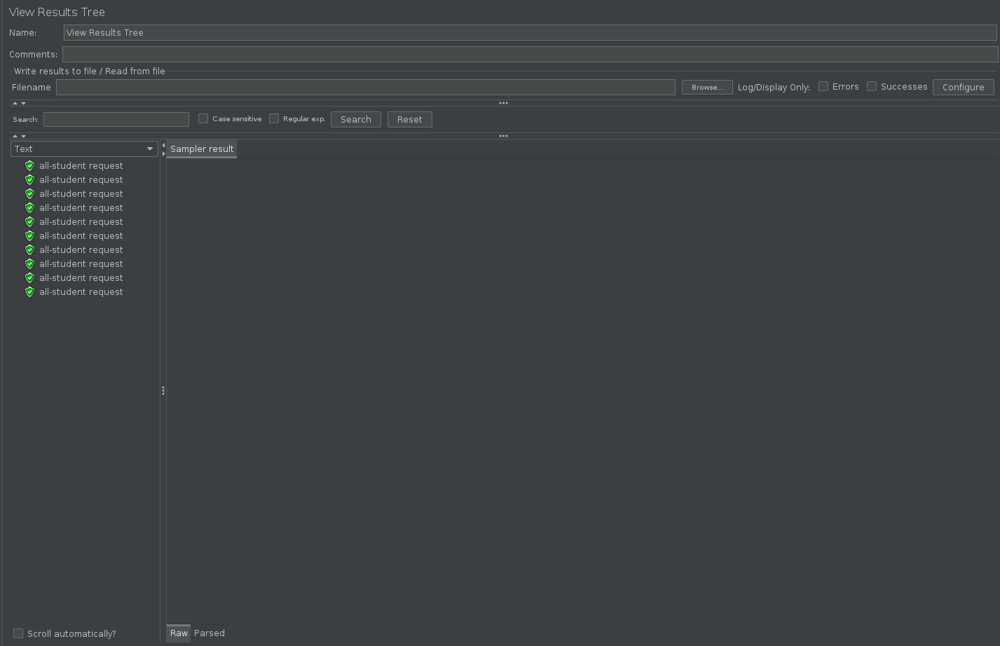
- **View Results in Table** : 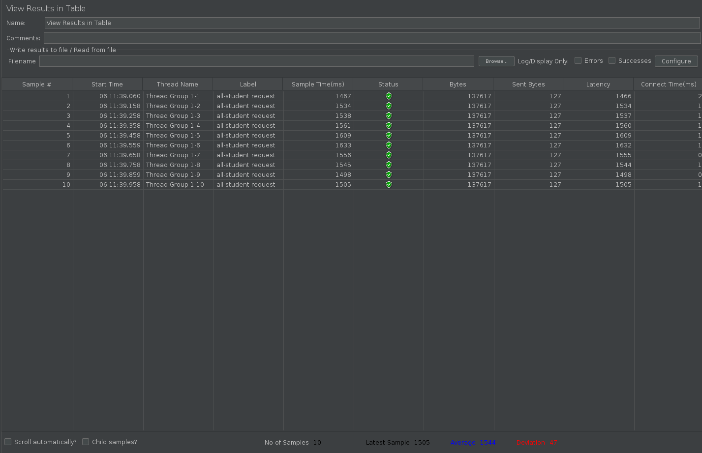
- **Summary Report** : 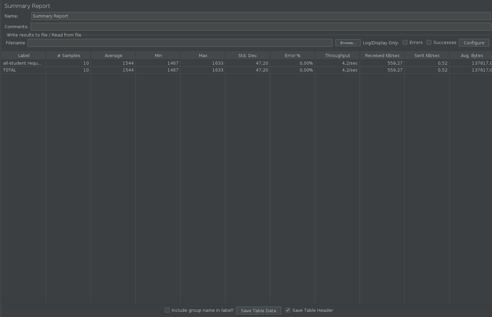
- **Graph Results** : 

---

## 2️⃣ Endpoint: `/all-student-name`
- **View Results Tree** : 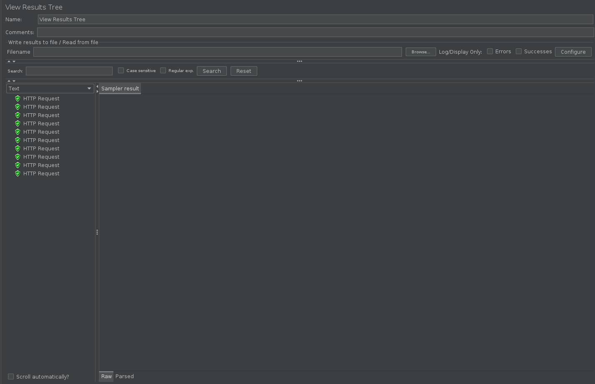
- **View Results in Table** : 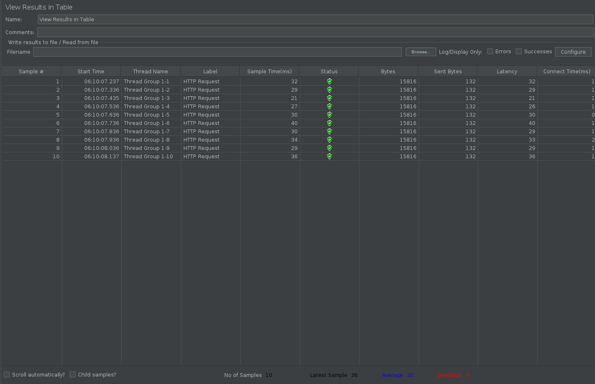
- **Summary Report** : 
- **Graph Results** : 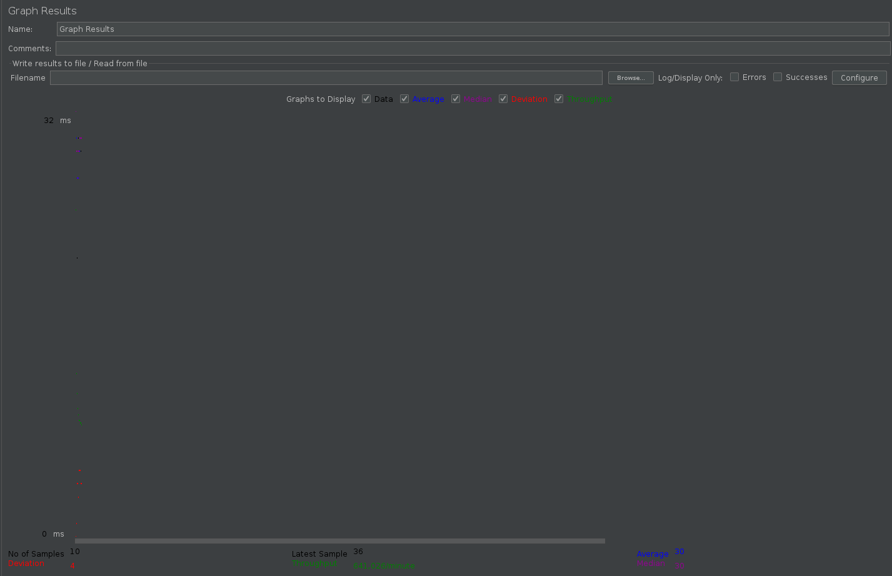

---

## 3️⃣ Endpoint: `/highest-gpa`
- **View Results Tree** : 
- **View Results in Table** : 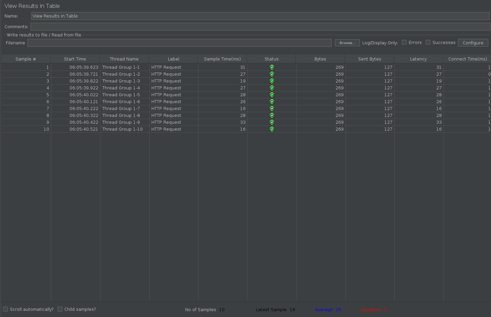
- **Summary Report** : 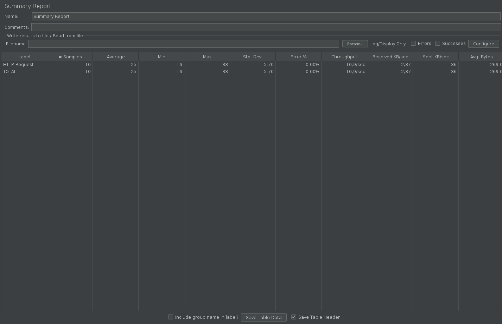
- **Graph Results** : 

# Results of the JMeter Tests via command line

## 1️⃣ Endpoint: `/all-student`
- **test_result_log1.jtL** : 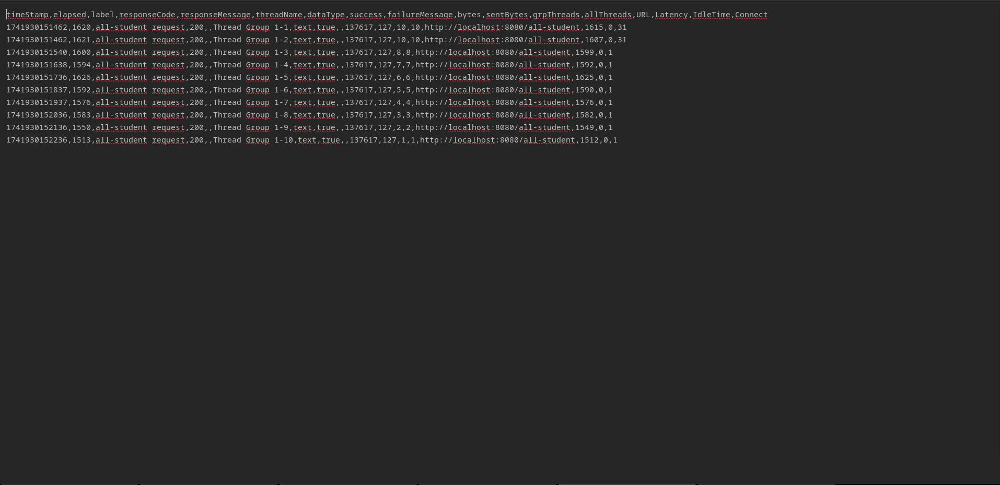

---

## 2️⃣ Endpoint: `/all-student-name`
- **test_result_log2.jtL** : 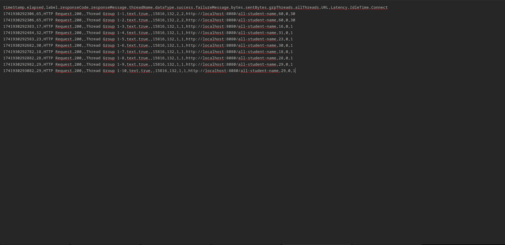

---

## 3️⃣ Endpoint: `/highest-gpa`
- **test_result_log3.jtL** : 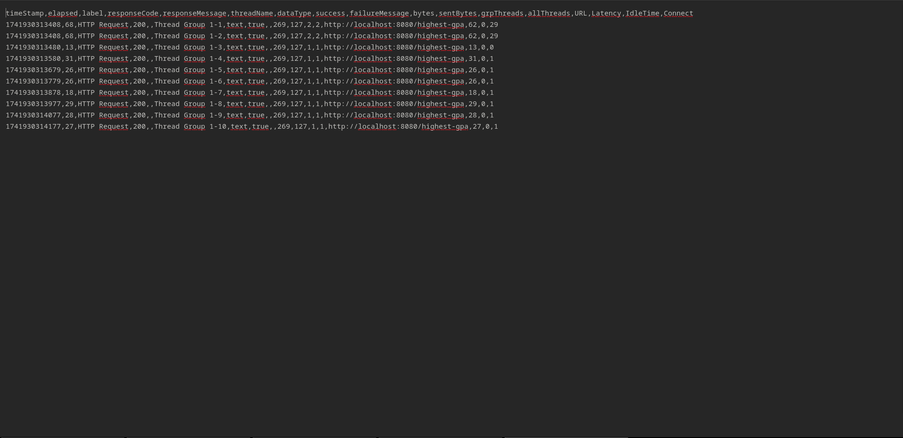
